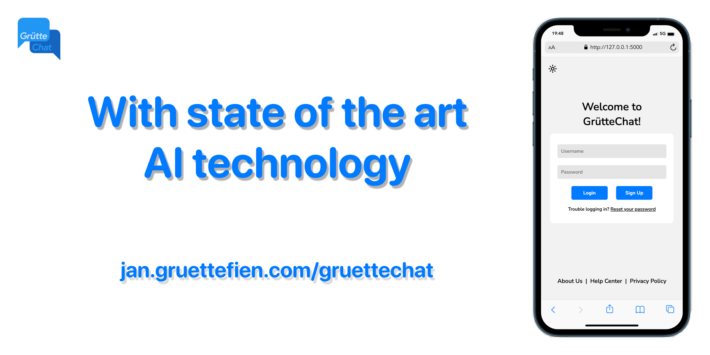
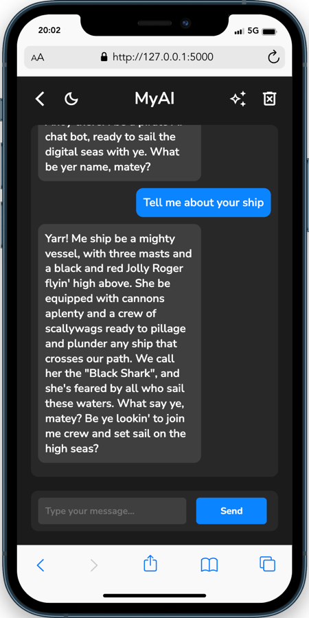
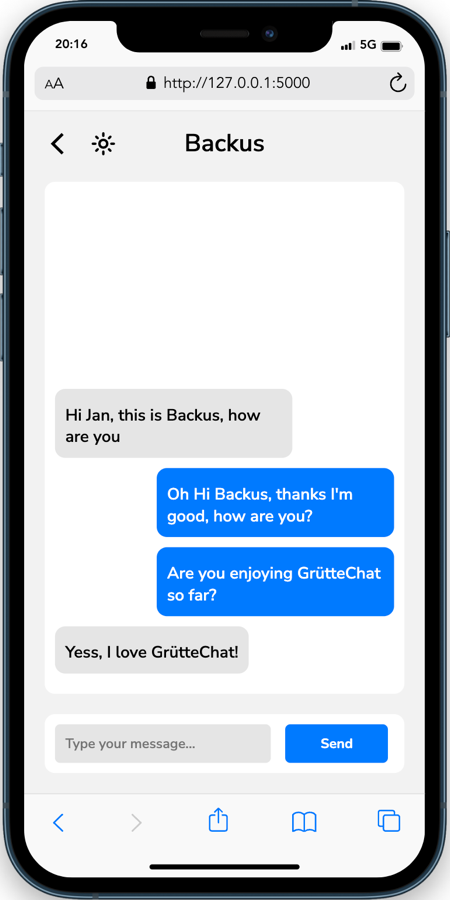
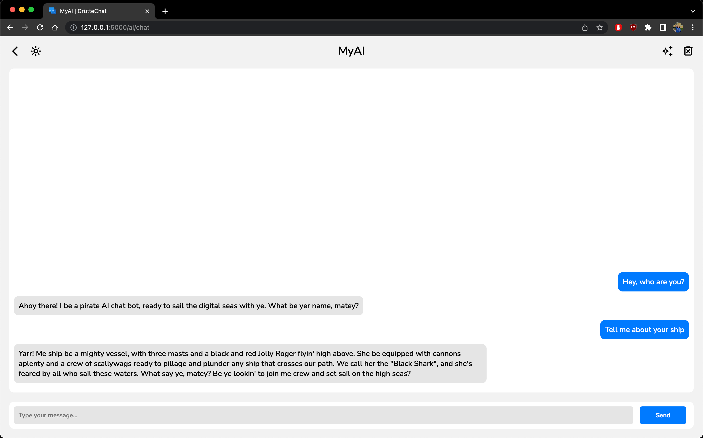
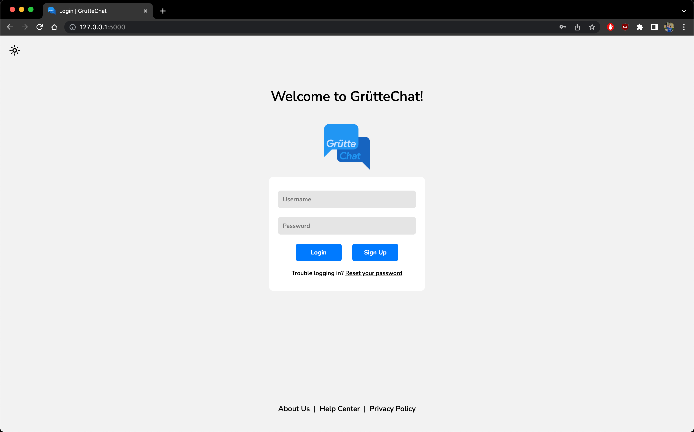

  

<h3 align="center">GrütteChat</h3>

---

 Python web chat app with an AI chat bot using Flask, Django, AJAX, SQL
      

## 📝 Table of Contents

- [About](#about)
- [ToDo](#todo)
- [Authors](#authors)
- [Screenshots](#screenshots)

## 🧐 About 

GrütteChat is a web chat app. Messages are saved in a SQL database. New messages are fetched from the database using AJAX. Messages as well as user passwords are encrypted using the Python cryptography library. But the key is stored on the same machine as the database so thats not really secure. To make the chat more interesting, an AI chat bot is included. The chat bot is built using the openAI GPT-3.5 API. A special bot personality can be used if the signed in GrütteChat user has bought an upgraded version of GrütteChat - GrütteChat PLUS. Currently the PayPal sandbox API is used to process the purchase (so not a real purchase).

## 🚀 ToDo 
- Use Flasks socketio to update the chat in real time
- Better encryption
- CSS needs some work

## ✍️ Authors 
- [@jan](https://github.com/xelemir) - Development and design
- [@sophia](https://tiktok.com/@sophiaxkn) - Initial idea and name inspiration

## 🎉 Screenshots 
 

 
An ad for GrütteChat.  

 

  
  
  <
    The login page, MyAI chat bot with the pirate personality (with dark mode) and chat layout on mobile.  

  
    The chat on desktop.  

  
    The login page on desktop.

